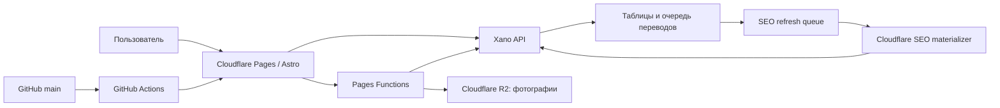

# SiteCraft Auto Market: правдивое состояние и roadmap

Обновлено: 22 августа 2026 года

Production: <https://automarket.sitecraft.agency>

Предыдущий production baseline, от которого выполнен аудит: `main`, commit `d842b2c`

## Назначение документа

Это основной русскоязычный контекст проекта. В новом рабочем чате сначала читать этот файл, затем проверять `git status`, текущий commit `main`, последний GitHub Actions run и production.

Секреты, токены Xano, ключи Cloudflare и содержимое `.env` сюда не записываются.

## Правила workflow

- Единственная рабочая и публикуемая ветка — `main`; новую ветку без отдельного разрешения не создавать.
- Push в `main` запускает `.github/workflows/cloudflare-pages.yml`.
- Workflow выполняет установку, проверки, тесты, сборку и deploy Cloudflare Pages.
- Frontend release и Xano release — разные операции. Перед изменением Xano обязателен backup затрагиваемого endpoint или таблицы.
- Локальные `.env.local` и `.xano.mcp.token` исключены из Git.
- Наличие страницы или кнопки не означает наличие backend. Production-функцией считается только проверенный полный контракт.

## Архитектура

- Astro: страницы, UI, язык, SEO, клиентские сценарии.
- Xano: auth, объявления, модерация, кредиты, справочники и данные переводов.
- Cloudflare R2: фотографии объявлений.
- GitHub `main`: единственный источник production frontend.

## Статусы возможностей

| Статус | Значение |
| --- | --- |
| `WORKING` | Есть backend и рабочий пользовательский сценарий. |
| `PARTIAL` | Основной сценарий есть, но известны ограничения или незакрытые риски. |
| `LOCAL_UI` | Функция работает только в браузере/localStorage и не синхронизируется между устройствами. |
| `UI_PROTOTYPE` | Это макет будущей функции, не production-возможность. |
| `MISSING/HIDDEN` | Backend отсутствует; действие не должно быть доступно пользователю. |

## Что работает

### Marketplace и продавец

- `WORKING`: главная, каталог, карточки списка и страница автомобиля.
- `WORKING`: публичные автомобили из Xano, связанные объявления и объявления продавца.
- `WORKING`: регистрация/вход, кабинет, контакты продавца, избранное.
- `WORKING`: ручное создание объявления, загрузка фото в R2, сохранение и отправка на модерацию.
- `WORKING`: AI-анализ фото, AI-черновик и отправка AI-черновика на модерацию.
- `WORKING`: редактирование и удаление собственного объявления.
- `WORKING`: модерация — approve, reject, block, delete, sold.
- `WORKING`: продвижение объявления за внутренние кредиты через `/dashboard/listings/{id}/promote`.
- `WORKING`: баланс и история кредитных операций.

### Deal Finder

- `WORKING`: лента, статистика, карточка, просмотр, save/unsave, hide/restore и перевод описания.
- `PARTIAL`: AI analyze не имеет подтверждённой единой политики списания кредита.
- `PARTIAL`: профили поиска читаются с сервера, но создание/редактирование/удаление backend пока отсутствуют.
- `LOCAL_UI`: workspace, comparison и notification settings используют локальное состояние браузера. Это не серверная синхронизация.

### Production и доставка

- `WORKING`: GitHub Actions → Cloudflare Pages.
- `WORKING`: фотографии через Cloudflare R2.
- `WORKING`: device-language resolver на первом посещении.
- `WORKING`: очередь SEO-обновлений связана с approve/edit/sold/block/delete и готовностью перевода.
- `WORKING`: Cloudflare SEO materializer строит полную неизменяемую генерацию 28 локалей; активный sitemap manifest служит единственным атомарным указателем версии.

Полный реестр backend: [`docs/xano/CURRENT_ENDPOINT_MANIFEST_RU.md`](docs/xano/CURRENT_ENDPOINT_MANIFEST_RU.md).

## Правдивое состояние мультиязычности

### Выбор языка устройства уже работает

Устаревшее утверждение «язык устройства не определяется» удалено. Production повторно проверен 11 августа 2026 года:

| Вход | Результат |
| --- | --- |
| `Accept-Language: de-DE,de` | `lang="de"`, LTR |
| `Accept-Language: ru-RU,ru` | `lang="ru"`, LTR |
| `Accept-Language: tr-TR,tr` | `lang="tr"`, LTR |
| неизвестный `hi-IN,hi` | fallback `lang="en"`, LTR |
| арабский | resolver и тесты выбирают `ar`, HTML использует RTL |

Приоритет выбора:

1. валидный явный `?lang=` или locale-prefixed URL;
2. ручной выбор, сохранённый в cookie;
3. первый поддерживаемый язык из `Accept-Language`;
4. английский для неизвестной ситуации.

Ручной выбор сохраняется при переходах и не должен сбрасываться на английский.

### Языковые уровни нельзя смешивать

- В selector настроено 28 локалей: 24 официальных языка ЕС плюс `ru`, `uk`, `ar`, `tr`.
- Полный структурно проверенный UI/public/static/taxonomy пакет подготовлен для всех 28 пользовательских локалей: 24 официальных языков ЕС плюс `ru`, `uk`, `ar`, `tr`. Словари 21 новой EU-локали машинные, проходят автоматические проверки полноты и placeholders, но требуют последующей лингвистической вычитки.
- Legacy `/cars?lang=` не является источником SEO-готовности. Production SEO использует только strict locale endpoints и не переключается на legacy catalog.
- 22 августа строгий materializer snapshot подтвердил 11/11 публичных объявлений в каждой из 28 локалей, то есть 308 locale/listing rows без языкового fallback. Generation `seo-3f1553ad7f6cae700283c1adf05fb9f3` атомарно активирована в production; catalog и sitemap всех 28 локалей повторно вернули 200 и 11/11.
- Полный indexable Stage 3 комплект подготовлен для всех 28 locale-prefix: catalog/detail, brand/model/city, canonical, sitemap, reciprocal `hreflang` и JSON-LD. Арабский smoke отдельно подтвердил `lang="ar"`, `dir="rtl"`.

Итог: полный технический контур 28 пользовательских языков готов в Xano и локальной frontend-сборке. Compatibility fallback выключен. После каждого изменения публичного объявления материализатор ждёт готовность переводов, применяет quality gate и только затем атомарно меняет активную генерацию.

## UI-прототипы и скрытые действия

В рамках этапа 1 UI приведён в соответствие с backend:

- скрыта навигация в кабинет дилера; direct-страница явно помечена `UI-прототип` и ничего не сохраняет;
- на pricing скрыты кнопки покупки и выбора Dealer Plan; страница не заявляет, что checkout доступен;
- скрыта покупка AI-кредитов из формы объявления;
- payment success больше не предлагает применить несуществующую покупку;
- в модерации скрыты archive/restore и добавление/удаление/назначение главного фото, потому что endpoints отсутствуют;
- admin dealers, purchases и paid products явно помечены как прототипы и не делают запросы к отсутствующим endpoints.

Рабочие действия не скрыты: создание объявления, модерация approve/reject/block/delete/sold, избранное, Deal Finder actions и продвижение за внутренние кредиты остаются доступны.

## Что не закончено

### Мультиязычные данные

- Английский Stage 3 выпущен первым: полный UI и public/static словари, полная taxonomy, 10/10 актуальных переводов объявлений, strict catalog/detail, indexable sitemap, canonical, reciprocal `hreflang` и smoke-тест.
- Французская волна `31–40` завершена отдельно малыми идемпотентными пакетами: 10/10 актуальных переводов, полный UI/public/static пакет и taxonomy, strict catalog/detail и полный локальный sitemap smoke без fallback.
- Немецкая strict-волна `82–91` завершена малыми идемпотентными пакетами: 10/10 актуальных переводов; canary, strict resolver и release-gate проверены. При rate limit обработка останавливалась и продолжалась безопасно.
- Турецкая волна `41–50` и арабская волна `51–60` завершены 10/10 малыми пакетами; явные rate limit не привели к повторному provider-вызову.
- Русский strict-релиз использует 10/10 исходных записей без платного перевода. Исправлены list/detail resolver endpoints `4009274/4009273`: source-ветка больше не обращается к отсутствующим колонкам `car_listings.seo_*`.
- Украинская актуальная волна `92–101` завершена 10/10. Исторический job №1 закрыт как непубличный без provider; старые jobs не использовались вместо актуального source hash.
- Волны `nl/da/sv/fi` и `es/pt/it` завершены 16 августа: создано и обработано 70 заданий `102–171`, по 10 на язык, малыми идемпотентными пакетами по два. Один временный сетевой сбой и Xano rate limit были безопасно продолжены без дублирования provider-вызова.
- Для всех семи новых локалей dry-run подтвердил `10/10`, затем release-gate включил `is_public=true`; живые strict catalog/detail вернули полный локализованный контент без fallback.
- Остальные EU-волны `pl/cs/sk/sl`, `bg/hr/ro/hu/el`, `et/lv/lt/mt/ga` завершены 16 августа: обработано 140 заданий `172–311`, по 10 на язык, идемпотентными пакетами максимум по три. Два Xano 429 были безопасно повторены на уровне queue-control.
- Для всех 14 локалей финальной волны dry-run подтвердил `10/10`, затем release-gate включил `is_public=true`; живые strict catalog/detail вернули полный локализованный контент без fallback.
- Xano release-gate `POST /translations/internal/locales/release` (ID `4011207`) сначала выполняет dry-run и включает `is_public` только при 100% готовности переводов публичного каталога.
- Управляемый Cloudflare Worker поддерживает все 27 целевых языков перевода (все пользовательские локали кроме исходного `ru`), пакеты до трёх заданий, идемпотентный claim/complete, dry-run и раздельные kill switches для manual и cron. Queue-control запросы безопасно повторяют явный Xano 429; provider-вызов автоматически не дублируется.
- Защита Xano Worker endpoints `4011152/4011153` повторно проверена: публичная строка-заглушка получает 403, рабочий secret не хранится в репозитории.
- Техническая миграция языков ЕС завершена; остаётся редакторская вычитка машинных UI/taxonomy и текстов объявлений носителями языков.
- Базовая frontend-конфигурация 28 публичных локалей опубликована; authoritative production smoke для bounded catalog/listing shards пройден, compatibility fallback выключен. Новая Xano generation подтверждена 11/11 для всех языков; после текущего Cloudflare Pages deploy выполняется финальный HTML/schema/canonical/hreflang smoke для `Product + Car + Offer` и похожих автомобилей.

### Backend-продукты

- Нет checkout, webhook, purchase state machine, refund/reconciliation.
- Нет dealer profile, dealer subscription и server-side entitlement.
- Нет moderation archive/restore и CRUD изображений модератором.
- Нет серверных записей Deal Finder workspace/comparison/notifications/inbox/sync logs и write-контрактов search profiles.

### Качество и безопасность

- Нужны rate limits и бюджеты для публичных/provider-backed AI endpoints.
- Нужен единый ledger и политика списаний AI-кредитов.
- `DONE`: добавлена автоматическая сверка `Xano public → Xano localized → sitemap → canonical page`; production schema использует Google-совместимую связку `Product + Car + Offer + BreadcrumbList`.
- `DONE`: quality gate исключает карточки без нормального заголовка/описания, марки, модели, года, цены, города и безопасной HTTPS-фотографии; неполная генерация 28×N не активируется.
- `DONE`: locale detail получает до шести похожих автомобилей, а taxonomy materializer сохраняет до трёх разных релевантных направлений перелинковки для каждого фасета.
- `DONE`: SEO compatibility fallbacks выключены в production build; строгие endpoints завершаются контролируемой ошибкой, а не подменой legacy-данными.
- Защищённые endpoints из реестра нужно периодически проверять отдельным staging/integration suite, а не только статическими тестами frontend.

## Следующий план

### Этап 2 — закрыть мультиязычный data contract

1. `DONE`: свежий export Xano endpoints/таблиц сверён с реестром; Worker endpoints записаны с production IDs.
2. `DONE`: английский canary и вся волна 10/10 завершены, публичное отображение проверено.
3. `DONE`: `fr`, `tr`, `ar` подготовлены отдельными очередями по 10 заданий.
4. `DONE fr`: canary и задания `31–40` обработаны малыми пакетами; release-gate и публичный strict resolver подтвердили 10/10.
5. `DONE de`: актуальная немецкая волна обработана 10/10, release-gate применён после dry-run.
6. `DONE tr/ar`: canary, малые пакеты, quality-check, release-gate и strict resolver подтвердили 10/10.
7. `DONE ru/uk`: русский выпущен как source locale 10/10; украинские jobs `92–101` завершены 10/10, непубличный legacy job закрыт без provider.
8. `DONE nl/da/sv/fi`: 40 заданий обработаны, UI/taxonomy/data/SEO readiness закрыты, release-gate применён после dry-run 10/10.
9. `DONE es/pt/it`: 30 заданий обработаны, UI/taxonomy/data/SEO readiness закрыты, release-gate применён после dry-run 10/10.
10. `DONE pl/cs/sk/sl`: 40 заданий обработаны, dry-run и release-gate подтвердили 10/10 по каждой локали.
11. `DONE bg/hr/ro/hu/el`: 50 заданий обработаны, dry-run и release-gate подтвердили 10/10 по каждой локали.
12. `DONE et/lv/lt/mt/ga`: 50 заданий обработаны, dry-run и release-gate подтвердили 10/10 по каждой локали.
13. `DONE`: frontend опубликован из `main`; production authoritative smoke и representative parity пройдены.
14. `DONE`: materializer snapshot подтвердил 11/11 для всех 28 локалей; approve/edit/sold/block/delete/translation-ready создают идемпотентные задания.
15. `NEXT`: редакторская вычитка машинных переводов носителями языков остаётся контентной задачей, а не техническим блокером parity.

### Этап 3 — SEO локалей

1. `DONE en`: strict catalog/detail возвращают 10/10 английских объявлений и не используют fallback.
2. `DONE en`: `/en/`, `/en/cars/`, brand/model/detail и public static routes получили canonical и indexable sitemap.
3. `DONE en`: карточки ведут на locale-prefixed detail, `x-default` указывает на эквивалентный legacy route, `de`/`en` имеют взаимные `hreflang` на общих страницах.
4. `DONE fr`: полный французский sitemap проверен URL за URL; canonical, JSON-LD, взаимные `en/fr` `hreflang`, `x-default` и 10 detail-страниц прошли smoke.
5. `DONE de`: немецкие 10/10 добавлены в strict sitemap; detail schema локализует legacy taxonomy, Offer связан с Vehicle и местом, добавлены crawlable brand/model/city связи и R2 `HEAD`.
6. `DONE`: production parity smoke пройден; root/locale/shard источники
   подтверждены как `xano_sharded`/`xano_pages_only`/`xano_slug_shard`.
   `NEXT`: отправить обновлённый `/sitemap.xml` в подключённую Search Console.
7. `DONE tr/ar/ru/uk`: все четыре локали имеют 10/10 strict data, отдельный sitemap и успешный локальный smoke; `ar` проверен в RTL.
8. `DONE nl/da/sv/fi`: полный локальный HTTP/SEO smoke проверил sitemap, static/catalog/detail, brand/model/city, canonical, reciprocal `hreflang`, JSON-LD и 10 detail-страниц каждого языка.
9. `DONE es/pt/it`: тот же полный HTTP/SEO smoke пройден; временный headers timeout при длинном общем прогоне воспроизвёлся как сеть и отдельный повтор `it` завершился без функциональных ошибок.
10. `DONE`: frontend, taxonomy, strict routes и sitemap подготовлены для оставшихся 14 языков ЕС; Xano catalog/detail подтверждены 10/10 без fallback.
11. `DONE`: полный локальный HTTP/SEO smoke пройден для `pl/cs/sk/sl/bg/hr/ro/hu/el/et/lv/lt/mt/ga`; ирландский повторён отдельно после сетевого headers timeout длинного общего прогона и завершился без функциональных ошибок.
12. `DONE`: frontend deploy и production authoritative smoke завершены; representative parity `de/ru/ar/fr` пройден.
13. `DONE`: создан production materializer с quality gate, immutable generation и атомарным manifest pointer; strict parity требует ровно 11 объявлений во всех 28 локалях.
14. `NEXT`: после текущего push в `main` выполнить внешний HTML/schema parity smoke и повторно отправить обновлённый sitemap в Search Console.

### Этап 4 — production hardening programmatic SEO

1. `DONE`: активная Xano generation сверена с live sources — 281/281 row,
   zero diff по 28 локалям.
2. `DONE`: parity audit переведён на bounded catalogue и listing shards.
3. `DONE`: CI требует только authoritative source headers и соблюдает Xano
   rate limit 10 запросов за 20 секунд.
4. `DONE`: transient compatibility responses запрещено кэшировать на edge.
5. `DONE`: три compatibility fallback выключены; fallback-off deploy и полный
   production smoke пройдены.
6. `NEXT`: автоматизировать idempotent materializer, reconciliation,
   freshness alerts и cache purge после atomic generation activation.

### Этап 5 — server-backed функции

1. Выбрать следующий продукт: commerce/dealer либо Deal Finder collaboration.
2. Сначала описать Xano schema, auth, idempotency, error contract и тесты.
3. Выпустить backend и проверить negative cases.
4. Только после этого показывать кнопку в production UI.

## Условия Production Go для новой функции

- Есть документированный Xano endpoint с ID, method, path и auth.
- Frontend не подменяет server authorization.
- Ошибки конкретны и ведут пользователя к исправлению.
- Мутации идемпотентны там, где возможен повторный запрос.
- Есть автоматические тесты и production smoke без изменения реальных данных, если это возможно.
- Документация и endpoint manifest обновлены в том же release.

## Инструкция для нового чата

> Прочитай `PROJECT_STATUS_AND_ROADMAP_RU.md` и `docs/xano/CURRENT_ENDPOINT_MANIFEST_RU.md`. Затем проверь `git status`, commit ветки `main`, последний GitHub Actions deploy и production. Не создавай новую ветку. Не считай UI-прототип backend-функцией и не показывай пользователю действие до выпуска проверенного endpoint.

Этот документ фиксирует состояние на дату обновления, но не заменяет повторную проверку production.
