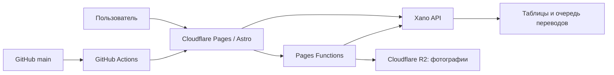

# SiteCraft Auto Market: состояние проекта и дальнейший план

Обновлено: 7 августа 2026 года

Актуальный production-коммит на момент отчёта: `cb4c538` (`main`)

Production: <https://automarket.sitecraft.agency>

## Назначение документа

Это основной русскоязычный файл контекста проекта. Его нужно читать в начале нового рабочего чата, чтобы не восстанавливать историю разработки по переписке.

Документ отвечает на четыре вопроса:

1. как устроена платформа;
2. что уже реализовано и опубликовано;
3. что сейчас работает не полностью;
4. какой следующий этап разработки.

Секреты, токены Xano, ключи Cloudflare и содержимое локальных `.env`-файлов сюда не записываются.

## Правила рабочего процесса

- Единственная рабочая и публикуемая ветка — `main`.
- Новые ветки без отдельного разрешения владельца не создавать.
- Push в `main` запускает `.github/workflows/cloudflare-pages.yml`.
- Workflow выполняет `npm ci`, `npm run check`, `npm test`, `npm run build` и публикацию Cloudflare Pages.
- Изменения Xano выпускаются отдельно от frontend и требуют резервной копии изменяемых endpoint'ов или таблиц.
- `.env.local` и `.xano.mcp.token` являются локальными секретными файлами и исключены из Git.
- Перед публикацией проверять `git diff`, не добавлять чужие или секретные файлы и оставлять рабочее дерево чистым.

## Архитектура

- Astro отвечает за страницы, интерфейс, выбор языка, SEO и отображение данных.
- Xano отвечает за авторизацию, объявления, модерацию, справочники и мультиязычные данные.
- Cloudflare R2 хранит фотографии объявлений.
- GitHub `main` является источником production-сборки frontend.

## Что уже сделано

### Базовая платформа

- Работают главная страница, каталог, карточки объявлений и отдельная страница автомобиля.
- Реализованы создание объявления, загрузка фотографий в R2, кабинет продавца и отправка на модерацию.
- Подключены Xano API, авторизация, публичные объявления, связанные объявления и системные справочники.
- GitHub Actions и Cloudflare Pages образуют рабочий production-конвейер.

Подробная карта остальных подсистем находится в `PROJECT_WORKFLOW_MAP.md`.

### Мультиязычный интерфейс

Поддерживаются шесть языков:

| Код | Язык | Направление |
| --- | --- | --- |
| `de` | немецкий | LTR |
| `ru` | русский | LTR |
| `uk` | украинский | LTR |
| `en` | английский | LTR |
| `ar` | арабский | RTL |
| `tr` | турецкий | LTR |

Выполнено:

- добавлен общий список поддерживаемых локалей;
- интерфейс, каталог, карточка автомобиля и основные системные значения получают текущую локаль;
- добавлены арабские и турецкие переводы статических текстов;
- арабский интерфейс использует `dir="rtl"`, остальные — `dir="ltr"`;
- переключатель языка показывает все шесть языков;
- ручной выбор языка записывается в cookie `sitecraft-locale` на один год;
- параметр `?lang=` передаётся страницам и публичным Xano endpoint'ам;
- добавлены `hreflang` для поддерживаемых языков;
- неизвестные языки Xano отклоняет, а frontend безопасно использует резервный язык;
- production smoke-тест подтвердил HTTP 200 для арабской и турецкой главной, каталога и страницы автомобиля.

### Мультиязычный Xano

- Используются таблицы `locales`, `taxonomy_translations`, `car_listing_translations`, `translation_jobs` и `content_migration_logs`.
- В production добавлены активные локали `ar` и `tr`.
- Публичные endpoints `/cars`, `/cars/{slug}`, `/seller-listings`, `/related`, `/locales` и `/taxonomies` принимают разрешённый `lang`.
- Оригинальное название и описание продавца не перезаписываются переводом.
- Перевод применяется только при корректной локали, статусе `completed` и актуальном хеше исходного текста.
- При отсутствующем или устаревшем переводе показывается оригинал.
- Перед изменениями арабского и турецкого контрактов сохранены production-бэкапы.

Подробности: `docs/xano/multilingual/README.md` и `docs/xano/multilingual/AR_TR_ROLLOUT_2026-08-06.md`.

### Последняя проверка и публикация

- Commit `cb4c538` опубликован из ветки `main`.
- GitHub Actions run `31129105061` завершён успешно.
- Cloudflare Pages deployment `33afc394-314d-4195-afd7-d3bfeec679a1` создан из `main` и source `cb4c538`.
- На этапе разработки прошли `npm run check`, `npm test` (283 теста) и `npm run build`.
- Рабочее дерево после публикации было синхронизировано с `origin/main`.

## Текущее поведение языка устройства

Автоматическое определение языка устройства **пока не реализовано**.

Текущий приоритет:

1. валидный параметр `?lang=`;
2. сохранённый cookie `sitecraft-locale`;
3. русский язык совместимости по умолчанию.

Заголовок браузера `Accept-Language` не анализируется. Поэтому новый пользователь без cookie открывает русскую версию независимо от языка iPhone. Production-проверка подтвердила одинаковый результат `lang="ru"` для арабского, турецкого, немецкого, русского и хинди `Accept-Language`.

Ручное переключение работает: например, `?lang=ar` открывает арабский RTL-интерфейс, а `?lang=tr` — турецкий LTR-интерфейс.

## Следующий этап: язык по локализации устройства

### Требуемое поведение

| Язык устройства или браузера | Результат сайта |
| --- | --- |
| русский | `ru` |
| немецкий | `de` |
| украинский | `uk` |
| английский | `en` |
| арабский, включая `ar-SA`, `ar-AE` и другие регионы | `ar` |
| турецкий, включая `tr-TR` | `tr` |
| любой неподдерживаемый язык, например хинди | `en` |

Желаемый приоритет выбора:

1. валидный `?lang=` в текущей ссылке;
2. язык, вручную выбранный пользователем и сохранённый в cookie;
3. первый поддерживаемый язык из `Accept-Language` с учётом порядка и коэффициента `q`;
4. английский `en` в любой непонятной ситуации.

Ручной выбор должен иметь приоритет над языком устройства, иначе сайт будет возвращать пользователя к системному языку после каждого перехода.

### План реализации

1. Добавить отдельный parser для `Accept-Language`.
2. Нормализовать региональные коды до базовых: `ar-SA -> ar`, `de-CH -> de`, `tr-TR -> tr`.
3. Пропускать неподдерживаемые языки и искать следующий разрешённый язык в списке браузера.
4. Использовать английский, если поддерживаемого языка в заголовке нет или заголовок отсутствует/повреждён.
5. Передать `Astro.request.headers.get("accept-language")` в серверный resolver локали.
6. Для первого посещения закрепить выбранную локаль в явном URL или безопасном cookie, чтобы Cloudflare не смешивал кеш страниц разных языков.
7. Сохранить текущий переключатель языка и его приоритет.
8. Проверить все публичные страницы, внутренние ссылки, запросы Xano, canonical и `hreflang`.

Предпочтительная реализация — серверная. Она отдаёт iPhone сразу правильный HTML и не создаёт мигания русской страницы перед переключением JavaScript.

### Обязательные тесты

- `ar-SA,ar;q=0.9` открывает арабский RTL-интерфейс;
- `tr-TR,tr;q=0.9` открывает турецкий интерфейс;
- `de-DE,de;q=0.9` открывает немецкий интерфейс;
- `ru-RU,ru;q=0.9` открывает русский интерфейс;
- `uk-UA,uk;q=0.9` открывает украинский интерфейс;
- `en-US,en;q=0.9` открывает английский интерфейс;
- `hi-IN,hi;q=0.9,en;q=0.8` выбирает английский;
- заголовок только с неподдерживаемым языком выбирает английский;
- пустой или некорректный заголовок выбирает английский;
- ручной cookie `tr` перекрывает арабский язык устройства;
- `?lang=de` перекрывает cookie и язык устройства;
- арабская страница получает `lang="ar"` и `dir="rtl"`;
- главная, каталог, карточки списка и страница автомобиля передают выбранный `lang` в Xano;
- после публикации выполнить production smoke-тест без cookie с разными `Accept-Language`.

## Дальнейший мультиязычный roadmap

После определения языка устройства:

1. Реализовать и проверить canary-worker для одной задачи из `translation_jobs`.
2. Проверить запись перевода, исходный язык, `source_hash`, статус и публичное отображение.
3. Запускать оставшуюся очередь переводов небольшими идемпотентными пакетами.
4. Заполнить переводы справочников и выявлять неизвестные legacy-значения без молчаливой подмены.
5. Проверить свободные тексты объявлений на всех шести языках и корректный fallback на оригинал.
6. Отдельно спланировать стабильные локализованные URL, canonical, sitemap и окончательную SEO-стратегию.
7. Исправить отдельную Cloudflare Workers Builds конфигурацию, которая использует неподходящую для Pages команду `wrangler versions upload`. Рабочий production-деплой сейчас выполняет GitHub Actions Pages workflow.

## Как продолжить работу в новом чате

Начальная инструкция новому разработчику или агенту:

> Прочитай `PROJECT_STATUS_AND_ROADMAP_RU.md`, затем проверь текущие `git status`, commit ветки `main`, последний GitHub Actions deployment и связанные документы. Не создавай новую ветку. Продолжай с раздела «Следующий этап», сохраняя совместимость Xano и не публикуя секреты.

Перед любыми изменениями нужно сверять фактическое состояние репозитория и production: этот файл фиксирует состояние на дату обновления, но не заменяет тестирование.
