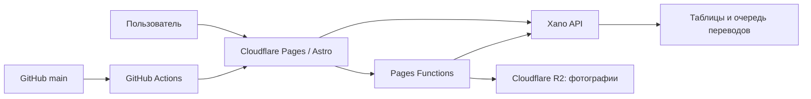

# SiteCraft Auto Market: правдивое состояние и roadmap

Обновлено: 11 августа 2026 года

Production: <https://automarket.sitecraft.agency>

Предыдущий production baseline, от которого выполнен аудит: `main`, commit `30e76f7`

## Назначение документа

Это основной русскоязычный контекст проекта. В новом рабочем чате сначала читать этот файл, затем проверять `git status`, текущий commit `main`, последний GitHub Actions run и production.

Секреты, токены Xano, ключи Cloudflare и содержимое `.env` сюда не записываются.

## Правила workflow

- Единственная рабочая и публикуемая ветка — `main`; новую ветку без отдельного разрешения не создавать.
- Push в `main` запускает `.github/workflows/cloudflare-pages.yml`.
- Workflow выполняет установку, проверки, тесты, сборку и deploy Cloudflare Pages.
- Frontend release и Xano release — разные операции. Перед изменением Xano обязателен backup затрагиваемого endpoint или таблицы.
- Локальные `.env.local` и `.xano.mcp.token` исключены из Git.
- Наличие страницы или кнопки не означает наличие backend. Production-функцией считается только проверенный полный контракт.

## Архитектура

- Astro: страницы, UI, язык, SEO, клиентские сценарии.
- Xano: auth, объявления, модерация, кредиты, справочники и данные переводов.
- Cloudflare R2: фотографии объявлений.
- GitHub `main`: единственный источник production frontend.

## Статусы возможностей

| Статус | Значение |
| --- | --- |
| `WORKING` | Есть backend и рабочий пользовательский сценарий. |
| `PARTIAL` | Основной сценарий есть, но известны ограничения или незакрытые риски. |
| `LOCAL_UI` | Функция работает только в браузере/localStorage и не синхронизируется между устройствами. |
| `UI_PROTOTYPE` | Это макет будущей функции, не production-возможность. |
| `MISSING/HIDDEN` | Backend отсутствует; действие не должно быть доступно пользователю. |

## Что работает

### Marketplace и продавец

- `WORKING`: главная, каталог, карточки списка и страница автомобиля.
- `WORKING`: публичные автомобили из Xano, связанные объявления и объявления продавца.
- `WORKING`: регистрация/вход, кабинет, контакты продавца, избранное.
- `WORKING`: ручное создание объявления, загрузка фото в R2, сохранение и отправка на модерацию.
- `WORKING`: AI-анализ фото, AI-черновик и отправка AI-черновика на модерацию.
- `WORKING`: редактирование и удаление собственного объявления.
- `WORKING`: модерация — approve, reject, block, delete, sold.
- `WORKING`: продвижение объявления за внутренние кредиты через `/dashboard/listings/{id}/promote`.
- `WORKING`: баланс и история кредитных операций.

### Deal Finder

- `WORKING`: лента, статистика, карточка, просмотр, save/unsave, hide/restore и перевод описания.
- `PARTIAL`: AI analyze не имеет подтверждённой единой политики списания кредита.
- `PARTIAL`: профили поиска читаются с сервера, но создание/редактирование/удаление backend пока отсутствуют.
- `LOCAL_UI`: workspace, comparison и notification settings используют локальное состояние браузера. Это не серверная синхронизация.

### Production и доставка

- `WORKING`: GitHub Actions → Cloudflare Pages.
- `WORKING`: фотографии через Cloudflare R2.
- `WORKING`: device-language resolver на первом посещении.

Полный реестр backend: [`docs/xano/CURRENT_ENDPOINT_MANIFEST_RU.md`](docs/xano/CURRENT_ENDPOINT_MANIFEST_RU.md).

## Правдивое состояние мультиязычности

### Выбор языка устройства уже работает

Устаревшее утверждение «язык устройства не определяется» удалено. Production повторно проверен 11 августа 2026 года:

| Вход | Результат |
| --- | --- |
| `Accept-Language: de-DE,de` | `lang="de"`, LTR |
| `Accept-Language: ru-RU,ru` | `lang="ru"`, LTR |
| `Accept-Language: tr-TR,tr` | `lang="tr"`, LTR |
| неизвестный `hi-IN,hi` | fallback `lang="en"`, LTR |
| арабский | resolver и тесты выбирают `ar`, HTML использует RTL |

Приоритет выбора:

1. валидный явный `?lang=` или locale-prefixed URL;
2. ручной выбор, сохранённый в cookie;
3. первый поддерживаемый язык из `Accept-Language`;
4. английский для неизвестной ситуации.

Ручной выбор сохраняется при переходах и не должен сбрасываться на английский.

### Языковые уровни нельзя смешивать

- В frontend настроено 29 локалей.
- Полностью вручную проверяемый UI-пакет сейчас есть для `de`, `ru`, `uk`, `en`, `ar`, `tr`, `fr`.
- Остальные европейские локали присутствуют в selector/URL, но значительная часть UI использует английский fallback. Их нельзя называть полностью переведёнными.
- Legacy Xano-данные поддерживают шесть локалей: `de`, `ru`, `uk`, `en`, `ar`, `tr`; strict SEO contract публично выпущен отдельно для `en` и `fr`.
- `GET /cars?lang=` отвечает 200 для этих шести языков и 400 для `fr`.
- Strict Release 4 endpoint для `en` и `fr` 11 августа вернул по 10/10 объявлений, strict detail — HTTP 200. Немецкая strict-волна остаётся неполной и не переведена в Stage 3.
- Полный indexable Stage 3 комплект подготовлен для `/en/` и `/fr/`; немецкие маршруты сохраняют legacy-режим до завершения немецких данных.

Итог: язык оболочки определяется и переключается, но «29 полностью переведённых языков с переведёнными данными» ещё не готово.

## UI-прототипы и скрытые действия

В рамках этапа 1 UI приведён в соответствие с backend:

- скрыта навигация в кабинет дилера; direct-страница явно помечена `UI-прототип` и ничего не сохраняет;
- на pricing скрыты кнопки покупки и выбора Dealer Plan; страница не заявляет, что checkout доступен;
- скрыта покупка AI-кредитов из формы объявления;
- payment success больше не предлагает применить несуществующую покупку;
- в модерации скрыты archive/restore и добавление/удаление/назначение главного фото, потому что endpoints отсутствуют;
- admin dealers, purchases и paid products явно помечены как прототипы и не делают запросы к отсутствующим endpoints.

Рабочие действия не скрыты: создание объявления, модерация approve/reject/block/delete/sold, избранное, Deal Finder actions и продвижение за внутренние кредиты остаются доступны.

## Что не закончено

### Мультиязычные данные

- Английский Stage 3 выпущен первым: полный UI и public/static словари, полная taxonomy, 10/10 актуальных переводов объявлений, strict catalog/detail, indexable sitemap, canonical, reciprocal `hreflang` и smoke-тест.
- Французская волна `31–40` завершена отдельно малыми идемпотентными пакетами: 10/10 актуальных переводов, полный UI/public/static пакет и taxonomy, strict catalog/detail и полный локальный sitemap smoke без fallback.
- Xano release-gate `POST /translations/internal/locales/release` (ID `4011207`) сначала выполняет dry-run и включает `is_public` только при 100% готовности переводов публичного каталога.
- Управляемый Cloudflare Worker выпущен с пакетами 1–2 задания, hard limit 3, идемпотентным claim/complete, dry-run и раздельными kill switches для manual и cron.
- Для `tr` и `ar` остаётся по 10 pending jobs публичных объявлений. Provider для этих волн ещё не запускался.
- В первом историческом batch остаются немецкое задание №6 и украинские №4/7; №1 относится к удалённому объявлению. Старые английские №2/5/8 закрыты как outdated и заменены актуальной завершённой волной.
- Не завершён массовый перевод справочников и остальных языков ЕС.
- Нет полного strict Xano data contract для `tr`, `ar` и остальных следующих языков.
- Для следующих языков ещё нет полного комплекта locale-prefixed SEO routes, canonical/hreflang и sitemap.

### Backend-продукты

- Нет checkout, webhook, purchase state machine, refund/reconciliation.
- Нет dealer profile, dealer subscription и server-side entitlement.
- Нет moderation archive/restore и CRUD изображений модератором.
- Нет серверных записей Deal Finder workspace/comparison/notifications/inbox/sync logs и write-контрактов search profiles.

### Качество и безопасность

- Нужны rate limits и бюджеты для публичных/provider-backed AI endpoints.
- Нужен единый ledger и политика списаний AI-кредитов.
- Нужен автоматический contract test, сравнивающий frontend routes с экспортом Xano.
- Защищённые endpoints из реестра нужно периодически проверять отдельным staging/integration suite, а не только статическими тестами frontend.

## Следующий план

### Этап 2 — закрыть мультиязычный data contract

1. `DONE`: свежий export Xano endpoints/таблиц сверён с реестром; Worker endpoints записаны с production IDs.
2. `DONE`: английский canary и вся волна 10/10 завершены, публичное отображение проверено.
3. `DONE`: `fr`, `tr`, `ar` подготовлены отдельными очередями по 10 заданий без запуска provider.
4. `DONE fr`: canary и задания `31–40` обработаны малыми пакетами; release-gate и публичный strict resolver подтвердили 10/10.
5. `NEXT`: выполнить canary и малые пакеты отдельно для `tr`, затем `ar`; после каждой волны проверить запись и публичный resolver.
6. `NEXT`: закрыть оставшиеся актуальные `de/uk` задания первого batch и непубличные legacy jobs без provider.
7. `NEXT`: инвентаризировать справочники и только затем добавлять остальные языки ЕС волнами, не открывая locale до полноты UI + data + SEO.

### Этап 3 — SEO локалей

1. `DONE en`: strict catalog/detail возвращают 10/10 английских объявлений и не используют fallback.
2. `DONE en`: `/en/`, `/en/cars/`, brand/model/detail и public static routes получили canonical и indexable sitemap.
3. `DONE en`: карточки ведут на locale-prefixed detail, `x-default` указывает на эквивалентный legacy route, `de`/`en` имеют взаимные `hreflang` на общих страницах.
4. `DONE fr`: полный французский sitemap проверен URL за URL; canonical, JSON-LD, взаимные `en/fr` `hreflang`, `x-default` и 10 detail-страниц прошли smoke.
5. `NEXT`: отдельно `tr`, затем `ar`, затем `ru` и `uk`; остальные языки ЕС выпускать пакетами из `src/i18n/releaseStage3.ts`.

### Этап 4 — server-backed функции

1. Выбрать следующий продукт: commerce/dealer либо Deal Finder collaboration.
2. Сначала описать Xano schema, auth, idempotency, error contract и тесты.
3. Выпустить backend и проверить negative cases.
4. Только после этого показывать кнопку в production UI.

## Условия Production Go для новой функции

- Есть документированный Xano endpoint с ID, method, path и auth.
- Frontend не подменяет server authorization.
- Ошибки конкретны и ведут пользователя к исправлению.
- Мутации идемпотентны там, где возможен повторный запрос.
- Есть автоматические тесты и production smoke без изменения реальных данных, если это возможно.
- Документация и endpoint manifest обновлены в том же release.

## Инструкция для нового чата

> Прочитай `PROJECT_STATUS_AND_ROADMAP_RU.md` и `docs/xano/CURRENT_ENDPOINT_MANIFEST_RU.md`. Затем проверь `git status`, commit ветки `main`, последний GitHub Actions deploy и production. Не создавай новую ветку. Не считай UI-прототип backend-функцией и не показывай пользователю действие до выпуска проверенного endpoint.

Этот документ фиксирует состояние на дату обновления, но не заменяет повторную проверку production.
