# SiteCraft Auto Market: Workflow Map

Audit basis: production commit `cdb94115892fa275f6670094a9ff2c0645530694`, repository inspection, and read-only Xano metadata on 2026-07-23.

## System Topology

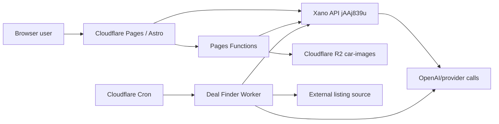

| Surface | Responsibility | Release mechanism | Status |
| --- | --- | --- | --- |
| Astro frontend | public and authenticated UI, client orchestration | GitHub Actions -> Cloudflare Pages | WORKING |
| Pages Functions | R2 upload/read, promotion/draft route handlers | bundled into Pages Advanced Mode | WORKING |
| Xano | auth, listings, moderation, credits, AI, Deal Finder state | managed separately in Xano | PARTIAL operational coupling |
| R2 | listing image objects | Cloudflare binding `CAR_IMAGES` | WORKING |
| Deal Finder Worker | source sync and queued AI analysis | separate Wrangler deployment | UNKNOWN live version |

## Identity and Session

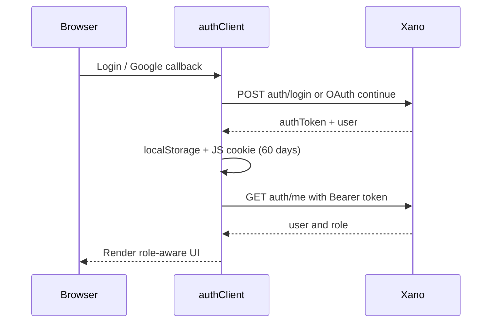

- Entry points: `src/pages/login.astro:115-245`, `src/pages/register.astro:104-180`, `src/pages/auth/google/callback.astro:81-211`.
- Session manager: `src/lib/authClient.ts:1-243`.
- Backend contracts: POST `/auth/login` 3968548, POST `/auth/register` 3968549, GET `/auth/me` 3968077, GET `/oauth/google/init` 3968076, POST OAuth continuation 3968099.
- `BROKEN`: duplicate registration of an OAuth-only email can set a password without identity verification. This workflow must be repaired before public sign-up.
- `PARTIAL`: frontend role visibility is a convenience only; Xano correctly needs to remain the authorization authority.

## Public Buyer Journey

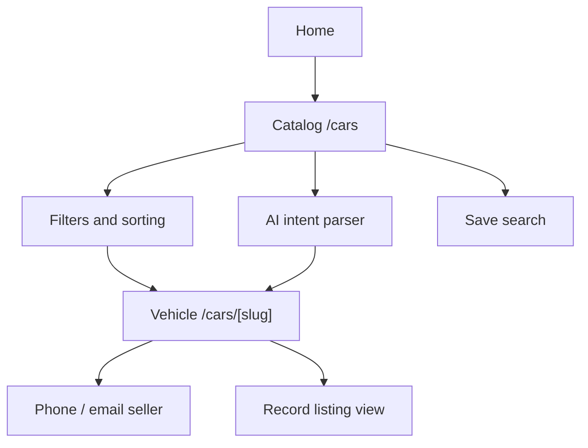

| Step | Contract | Status | Notes |
| --- | --- | --- | --- |
| Load inventory | GET `/cars` 3966698 | WORKING | public approved projection |
| Open vehicle | GET `/cars/{slug}` 3966699 | WORKING | seller contact and masked VIN |
| Related seller stock | GET `/cars/{slug}/seller-listings` 3985671 | WORKING | public projection |
| Record view | POST `/analytics/listing-view` 3981281 | WORKING | public endpoint |
| AI query parsing | POST `/ai/search/intent` 3981451 | BROKEN | public, unmetered, no observed rate limit |
| Save search | POST `/saved-searches` 3981320 | WORKING | authenticated |

## Manual Seller Listing

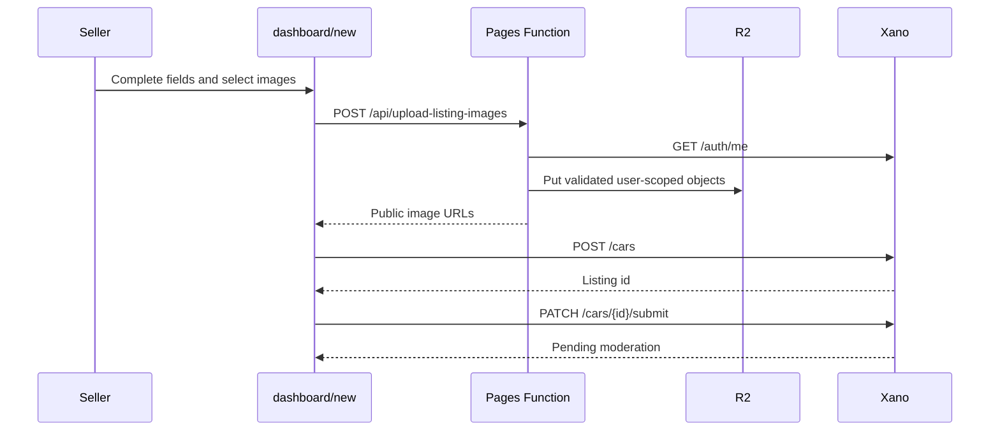

- UI orchestration: `src/pages/dashboard/new.astro:3180-3428`.
- Upload: `functions/api/upload-listing-images.ts:24-320`.
- Contracts: POST `/cars` 3966700, PATCH `/cars/{id}/submit` 3966701.
- `WORKING`: normal success path is complete.
- `PARTIAL`: uploaded objects can become orphaned when the later Xano operation fails.

## AI-Assisted Seller Listing

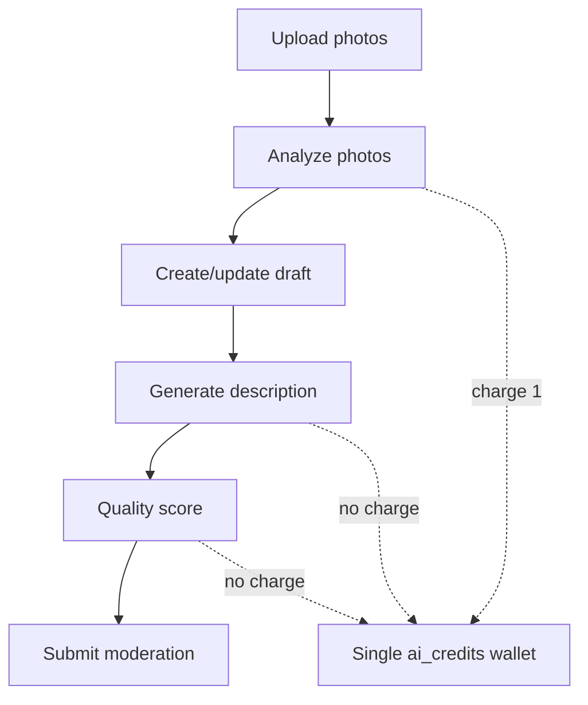

| Step | Endpoint | Status | Evidence |
| --- | --- | --- | --- |
| Analyze photos | POST `/ai/listing/analyze-photos` 3979609 | WORKING | charges one credit |
| Create draft | POST `/listings/create-draft` 3982637 | WORKING | authenticated |
| Load/update draft | GET/PATCH `/dashboard/drafts/{id}` 3974028/3974029 | WORKING | owner scoped |
| Generate description | POST `/ai/listing/generate-description` 3981498 | PARTIAL | no consistent credit charge; local fallback |
| Quality score | POST `/ai/listing/quality-score` 3981478 | PARTIAL | no consistent credit charge; local fallback |
| Submit moderation | POST `/listings/submit-moderation` 3982675 | WORKING | authenticated |
| Publish draft | POST `/dashboard/drafts/{id}/publish` 3974031 | WORKING | alternate path |

The flow is implemented in `src/pages/dashboard/new.astro:2527-3140`. The main product risk is contractual, not missing UI: users cannot predict which AI action consumes a credit.

## Seller Management

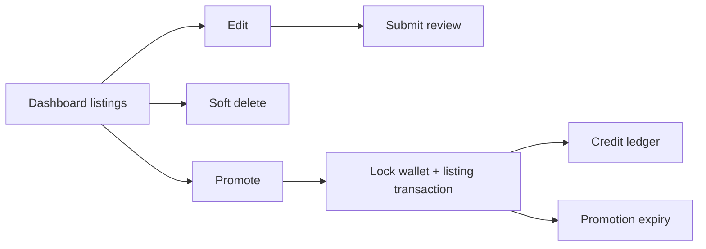

- GET `/dashboard/listings` 3968100: `WORKING`.
- GET/PATCH `/dashboard/listings/{id}` 3995774/3969714: `WORKING`.
- PATCH `/dashboard/listings/{id}/delete` 3983598: `WORKING`.
- POST `/dashboard/listings/{id}/promote` 3995775: `WORKING`, transactional/idempotent.
- GET `/dashboard/summary` 3995777 and credit history 3995776: `WORKING`.
- Promotion UI: `src/pages/dashboard/cars/promote.astro:65-266`.

## Moderation

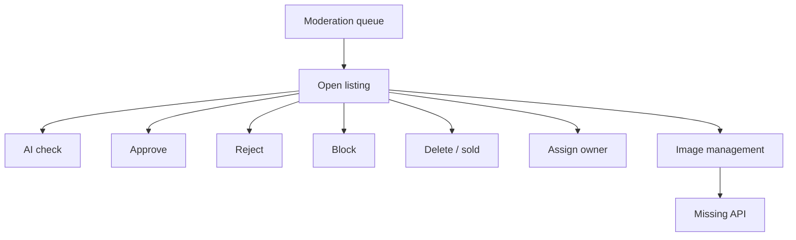

Core endpoints are backend-authorized and `WORKING`: GET `/admin/moderation` 3966702 plus approve/reject/block/delete/sold/assign-owner. AI moderation POST `/ai/moderation/check-listing` 3981578 is `PARTIAL` because UI can fall back locally.

Image add/delete/primary and archive/restore commands in `src/pages/admin/moderation.astro:890-973` are `MISSING`. The current UI must not imply they succeeded.

## Credits and Promotion

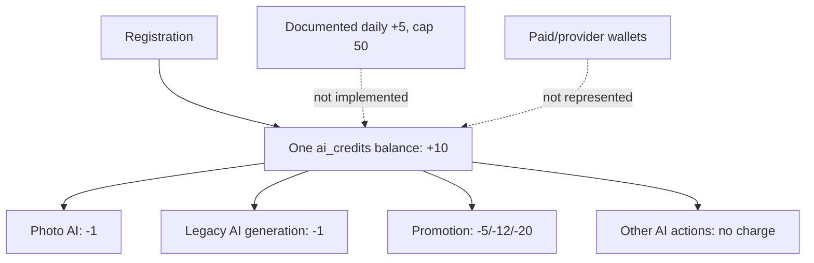

The promotion transaction is `WORKING`; the wallet policy is `BROKEN`. The single Xano balance is used by both AI and promotion. `/me/credits` 3974027 can also mutate admin role and grant a hardcoded huge balance, which must be removed.

## Paid Purchase Journey

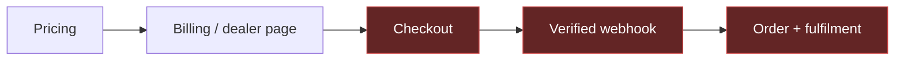

Only pricing and balance/history UI exist. `/purchases/create`, `/purchases/apply`, `/me/purchases`, provider checkout, webhooks, refunds, reconciliation, dealer profiles, and subscription entitlements are `MISSING` or `UI_ONLY`.

## Deal Finder

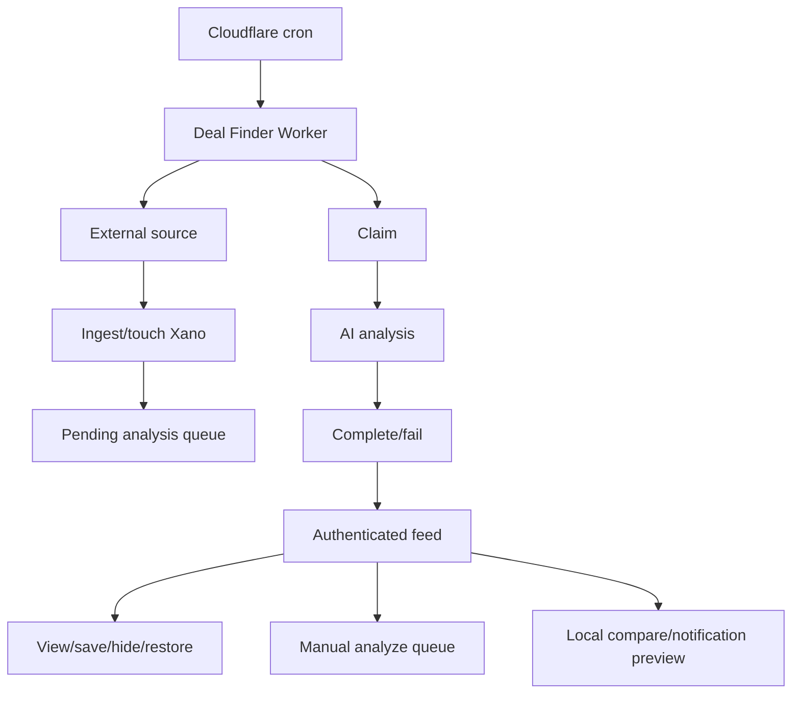

### Working server flow

- Worker health, secret-protected sync/analysis, cron dispatch: `workers/deal-finder-sync/src/index.ts:97-152`.
- Internal Xano endpoints: active searches, existing IDs, ingest, touch-seen, pending, claim, complete, fail, and preflight.
- Frontend Xano endpoints: stats, list, detail, view/save/unsave/hide/restore, analyze, and search GET.

### Missing server flow

- Search create/update/delete.
- Description translation.
- Shared workspace and server-side comparisons.
- Notification preferences, delivery records, channels, and retries.
- Inbox/email retrieval (client currently returns `[]`).
- Sync log/report endpoint.

### Scale risk

Xano list and stats scripts fetch the latest analysis inside listing loops. Replace N+1/2N+1 lookups with joined/precomputed current-analysis fields or a batch query before increasing inventory limits.

## SEO Publishing

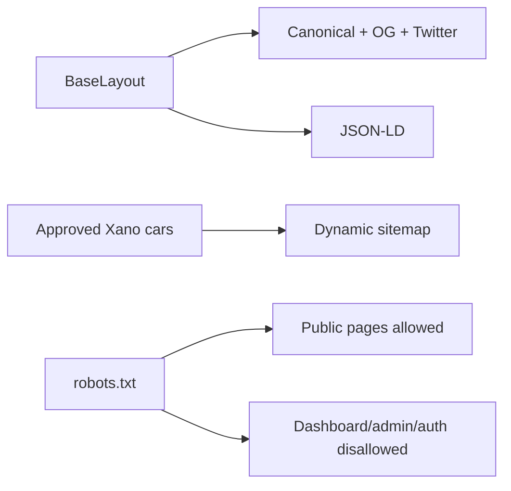

Core SEO is `WORKING`. Fix pricing offer accuracy, stable sitemap timestamps, and add `impressum` to the explicit static sitemap routes.

## Operational Workflow

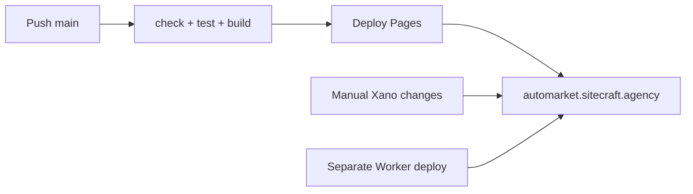

The Pages lane is `WORKING`. Xano and Worker changes are separately released, so compatibility and rollback are `PARTIAL`. Add a release record containing frontend SHA, Xano workspace/version, Worker version, migrations, environment checksum, smoke results, and rollback owner.
